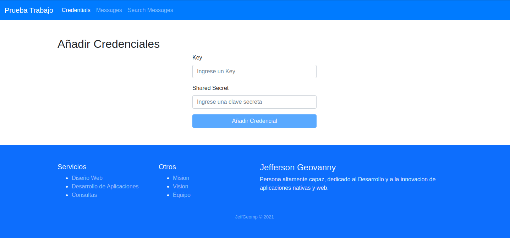
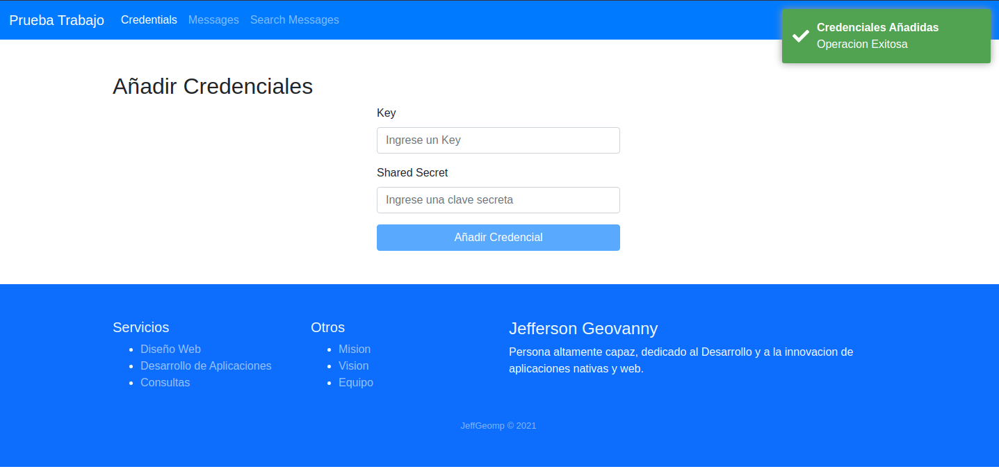
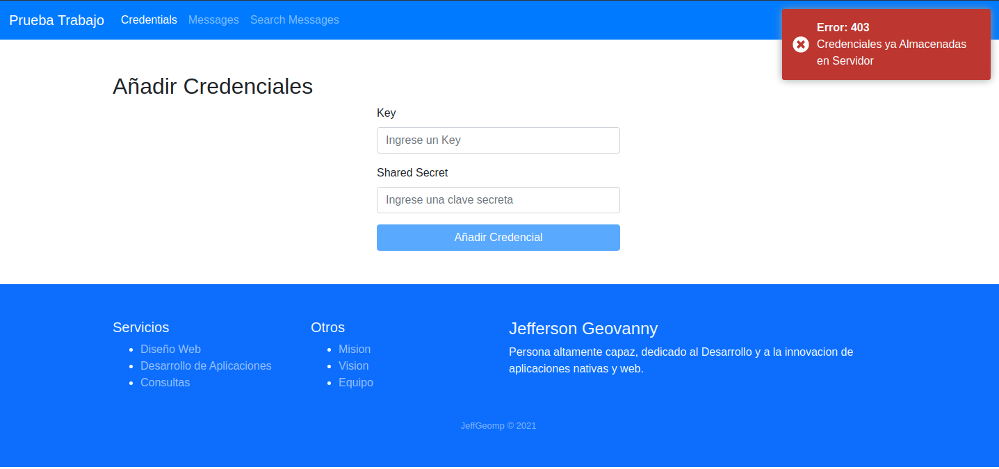
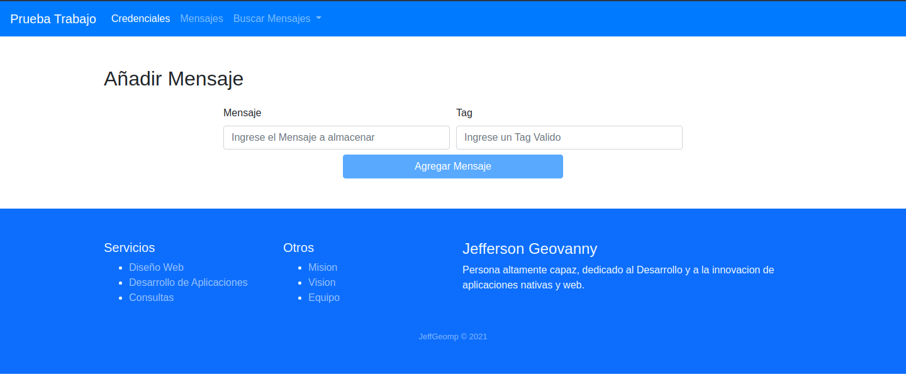
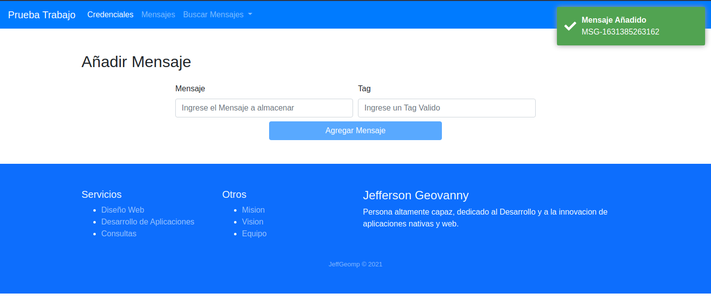
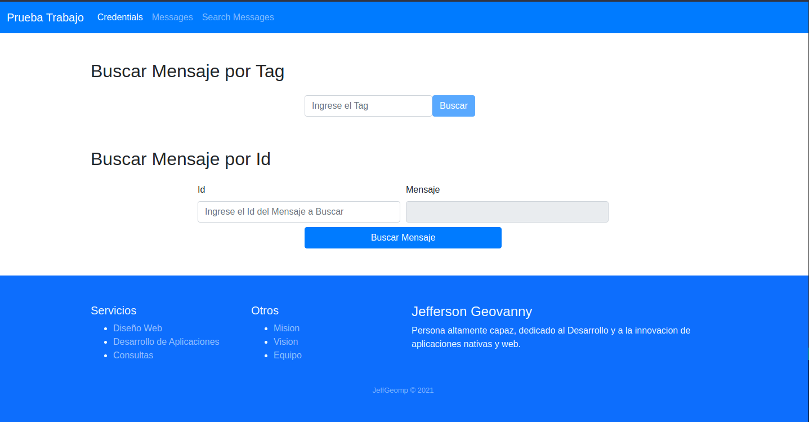
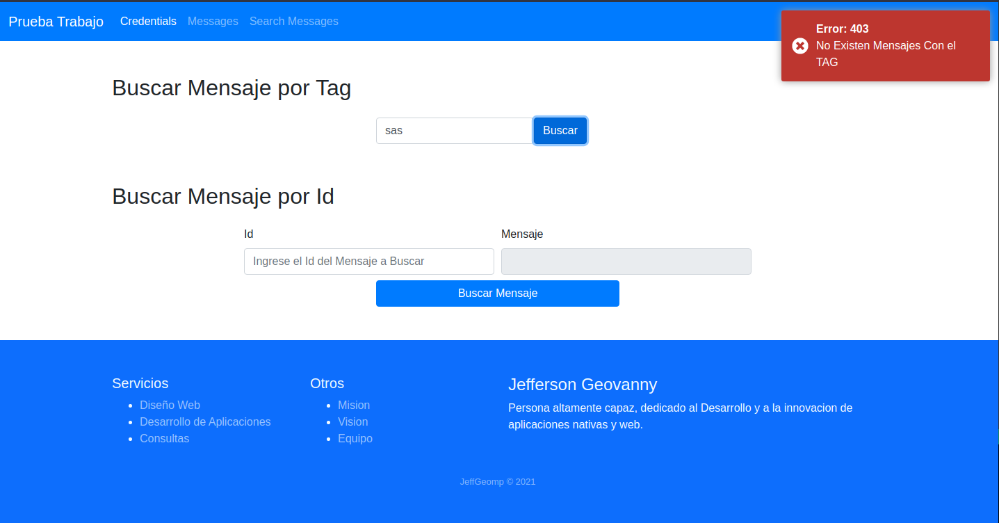
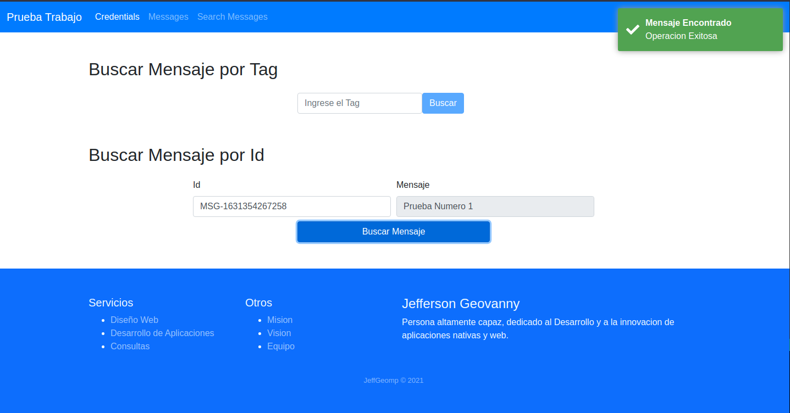
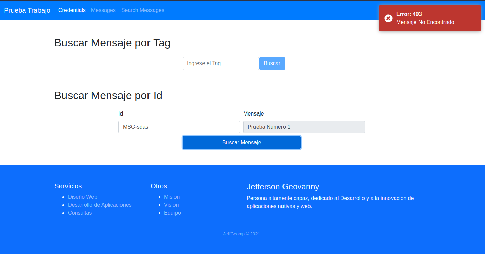

# Aplicacion para Trabajo

- [Aplicacion para Trabajo](#aplicacion-para-trabajo)
    - [Description 🚀](#description-)
    - [Prerequisitos:](#prerequisitos)
    - [Instalación 🔧](#instalación-)
    - [Demo 💻](#demo-)
    - [Contacto 📱](#contacto-)
    - [Licencia 📄](#licencia-)

### Description 🚀
_Proyecto que consume una api rest, con angular como frontend_

### Prerequisitos:
- [X] Instalacion de Nodejs y npm

### Instalación 🔧
- [X] Descargar o Clonar el Repositorio de manera local
- [x] Dirigirse al Directorio server/ y ejecutar el comando `npm install` y posteriormente correr el servidor como `npm run serve` o `node src/index.js`
- [X] Dirigirse al Directorio webapp/ y ejecutar el comando `npm install` y posteriormente correr el servidor como `ng serve`

### Demo 💻
Pagina principal de la aplicacion

El Boton se activa cuando los dos campos requeridos no son vacios, Si la clave no existe en el sistema la clave sera añadida

Si, la clave existe mostrara un mensaje de error, describiendo lo que ha sucedido

En Esta vista podemos añadir mensajes al sistema

Al añadir un mensaje, se nos mostrara que el mensaje a sido añadido. el sistema recibe un tag por peticion.

* El Id sera retornado mediante el mensaje informativo

En esta vista se podra realizar busquedas de los mensajes ya sea por tag o por id

Al buscar por tag, y si hay mensajes con el tag requerido se mostrara una tabla con los mensajes y la informacion de este.

Cuando no existen mensajes relacionados con el tag, se nos mostrara un mensaje de error, con la descripcion de lo sucedido.

Al Buscar por mensaje de texto debemos introducir el id y presionar buscar, si existe el id se nos mostrara el mensaje asociado a este Id.

Si no existe un mensaje asociado con el Id se mostrara un error, con la descripcion de lo sucedido

### Contacto 📱
* developed by **Jefferson Geovanny Moreno Perez** 
* Telefono : 45217382

### Licencia 📄
[MIT](https://choosealicense.com/licenses/mit/)