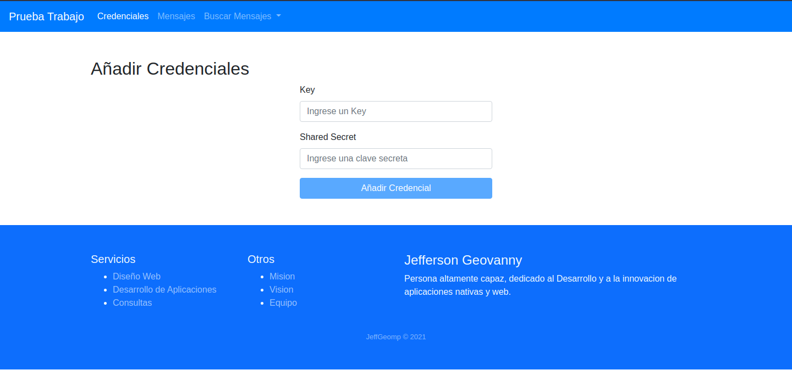
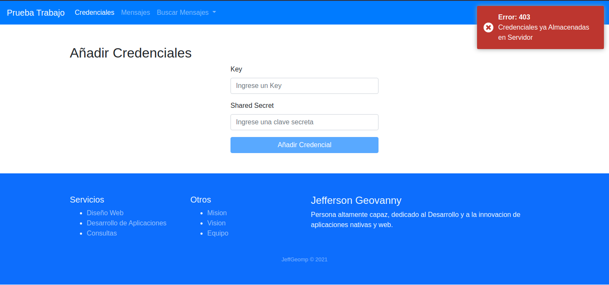
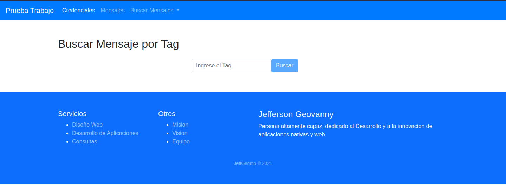
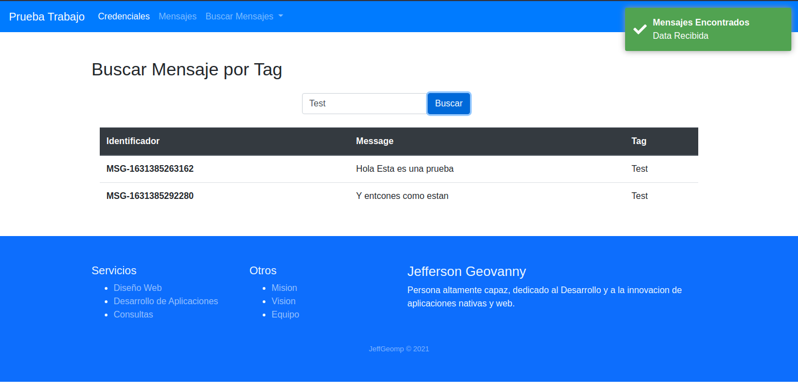
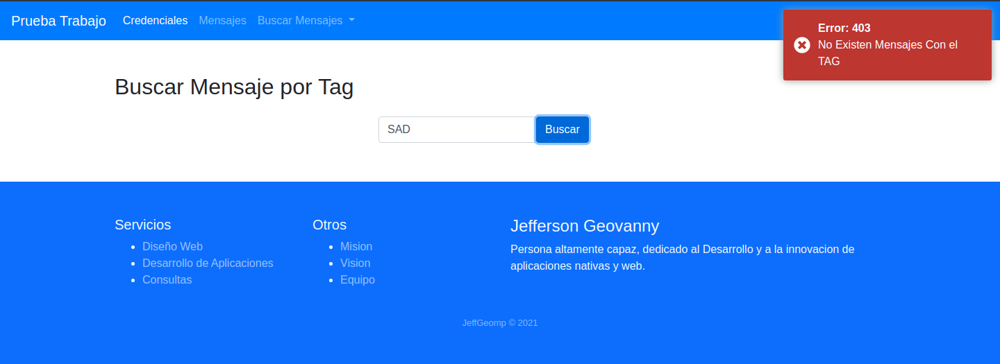
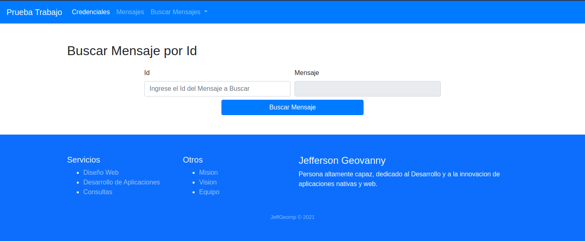
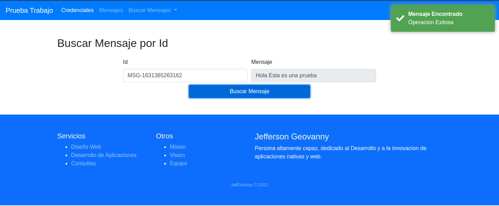
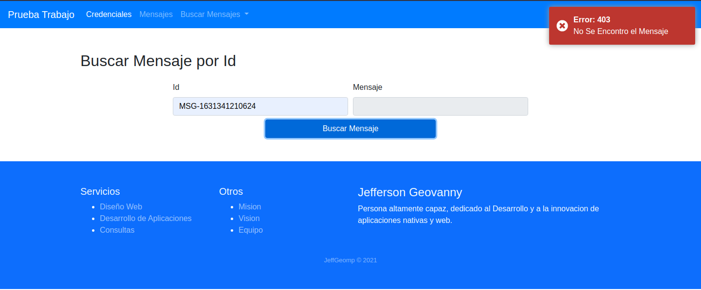

# Aplicacion para Trabajo

- [Aplicacion para Trabajo](#aplicacion-para-trabajo)
    - [Description 🚀](#description-)
    - [Prerequisitos:](#prerequisitos)
    - [Instalación 🔧](#instalación-)
    - [Demo 💻](#demo-)
    - [Contacto 📱](#contacto-)
    - [Licencia 📄](#licencia-)

### Description 🚀
_Proyecto que consume una api rest, con angular como frontend_

### Prerequisitos:
- [X] Instalacion de Nodejs y npm

### Instalación 🔧
- [X] Descargar o Clonar el Repositorio de manera local
- [x] Dirigirse al Directorio server/ y ejecutar el comando `npm install` y posteriormente correr el servidor como `npm run serve` o `node src/index.js`
- [X] Dirigirse al Directorio webapp/ y ejecutar el comando `npm install` y posteriormente correr el servidor como `ng serve`

### Demo 💻
Pagina principal de la aplicacion

El Boton se activa cuando los dos campos requeridos no son vacios, Si la clave no existe en el sistema la clave sera añadida

Si, la clave existe mostrara un mensaje de error, describiendo lo que ha sucedido

En Esta vista podemos añadir mensajes al sistema

Al añadir un mensaje, se nos mostrara que el mensaje a sido añadido. el sistema recibe un tag por peticion.

> El Id sera retornado mediante el mensaje informativo

Aqui se podran realizar busquedas por un TAG en especifico

Al buscar por tag, y si hay mensajes con el tag requerido se mostrara una tabla con los mensajes y la informacion de este.

Cuando no existen mensajes relacionados con el tag, se nos mostrara un mensaje de error, con la descripcion de lo sucedido.

Aqui podremos buscar mensajes por su identificador

Al Ingresar el Identificador y si hubiera un mensaje asosciado a esta clave se mostrara en el recuadro de mensaje.

>El Cuadro Mensaje es Solo Lectura Unicamente

Si no existiera un mensaje asociado a la clave especificada mostrara un error

### Contacto 📱
* developed by **Jefferson Geovanny Moreno Perez** 
* Telefono : 45217382

### Licencia 📄
[MIT](https://choosealicense.com/licenses/mit/)